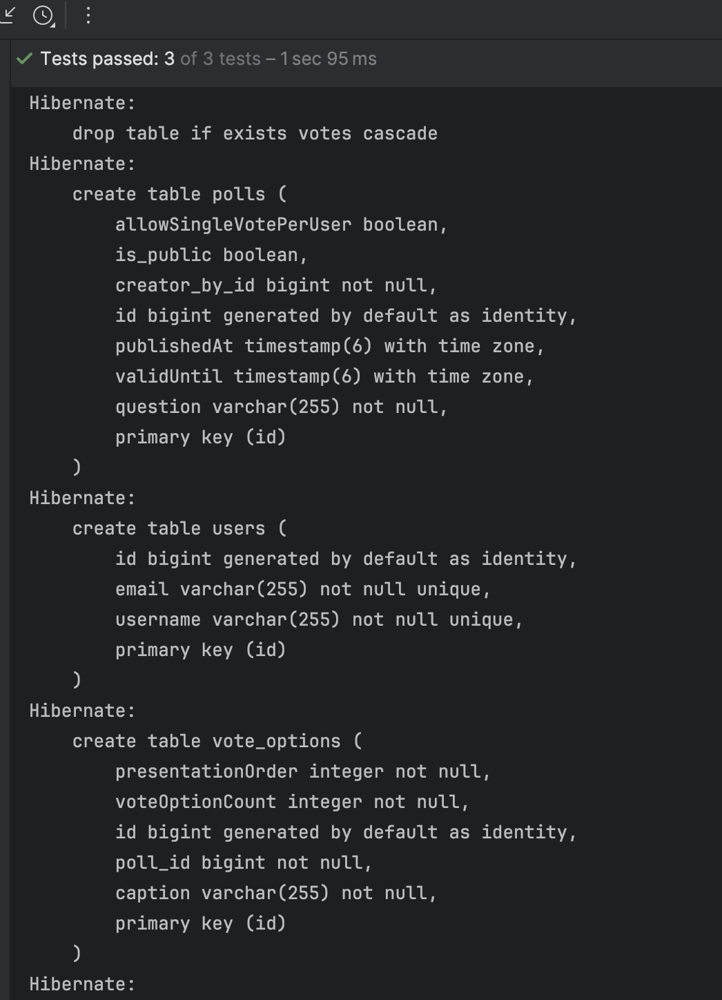
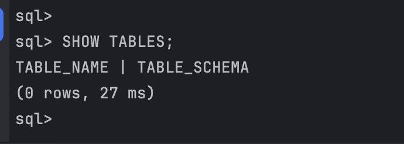
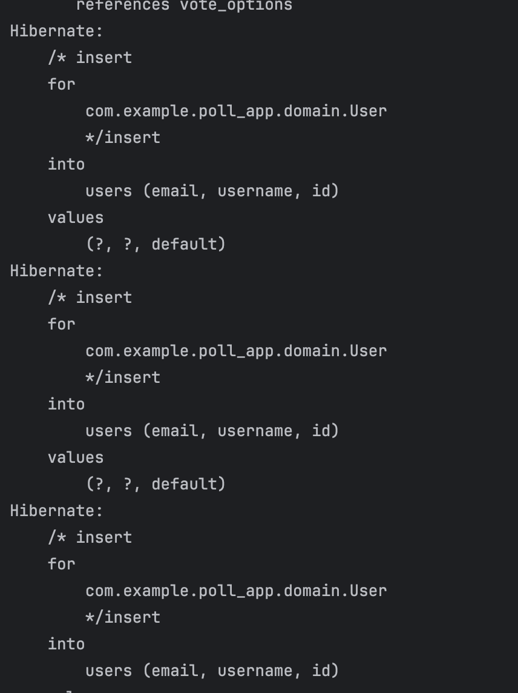

# Poll app project report

## Set up and installation
Tech stack used:
- Java 21 + Gradle
- JPA with Hibernate 7.1.1
- H2 database
- Test framework: JUnit 5
- EntityManagerFactory

### Issues encountered 🙃
### Database tables
Tables created by Hibernate (H2) for this experiment:
- USERS
- POLL
- VOTE
- VOTE_OPTION

### 1. mappedBy headache
At first, Hibernate threw:
Basically, my `User` entity thought `Poll` had a `creator` field, but I called it `createdBy`.  
Fix: renamed `mappedBy="creator"` → `mappedBy="createdBy"` in `User`.  
So Hibernate is very literal...

### 2. `createdBy` not resolving
The JPQL queries were failing because my field was incorrectly named or mismatched between entities, therefore ensured `Poll` had `@ManyToOne User createdBy` and all references in queries used the same name.

### 3. Controllers were making trouble
	•	The main issue was adjusting my existing code to the assignment and tests, which ended up confusing me.
	•	My controllers were causing so many exceptions that I couldn’t even run a simple test.
	•	My solution: copied the original repo into a new one and stripped it down to just the entities and test code. I even had to delete all controllers 😭 to make the tests run green.

PS.: I have used H2 before in a few projects, but usually I started with it from scratch and implemented entities first.  
This time, adjusting an existing project to fit the tests was a new challenge, but somehow I managed it 😅.
Ohh, and I forget to commit regularly, because of the confusion

### Code
👉 [My code for experiments 1-2-(3?)](https://github.com/enikoandrea123/poll-app)
👉 [My code for experiments 4 (so this)](https://github.com/enikoandrea123/poll-app-experiment4


I just added this 3 lines of code to the SetUp() to show the SQL log:
.property("hibernate.show_sql", "true")
.property("hibernate.format_sql", "true")
.property("hibernate.use_sql_comments", "true")




## Inspecting the database

I am using H2 in-memory and to see what's going on there I had to install the h2-tools dependency:

```
dependencies {
    implementation("com.h2database:h2:2.3.232")
    runtimeOnly("com.h2database:h2-tools:2.3.232") // contains Shell/Console
}
```
Then, after I ran my tests and manually checked the database in cmd since it is stores in local (polls.mv.db)
However, when I checked for tables they where empty.
)
But in the logs it shows that it actually inserting and adding data to the database.
)
